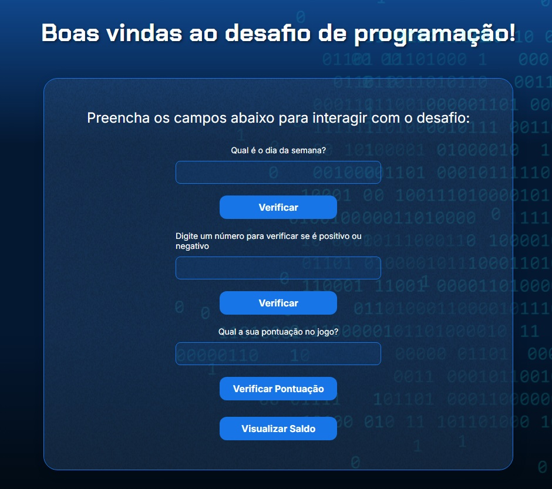

# 🎮 Desafio de Programação JavaScript - Alura

<p align="center">
  <a href="https://lgjor.github.io/desafios-js-alura/" target="_blank">
    
  </a>
</p>

Um projeto interativo desenvolvido para praticar conceitos fundamentais de JavaScript através de desafios práticos e divertidos.

## 📋 Sobre o Projeto

Este projeto implementa uma interface web interativa que apresenta 5 desafios de programação JavaScript, permitindo aos usuários testar seus conhecimentos através de formulários interativos e feedback imediato.

## ✨ Funcionalidades Implementadas

### 🗓️ **1. Verificação de Dia da Semana**
- Captura o dia da semana digitado pelo usuário
- Valida entrada com múltiplos formatos (ex: "segunda", "segunda-feira")
- Retorna mensagem personalizada:
  - **Fim de semana**: "Bom fim de semana!" (sábado/domingo)
  - **Dias úteis**: "Boa semana!"

### 🔢 **2. Verificação de Números Positivos/Negativos**
- Valida se o número digitado é válido
- Classifica o número em:
  - **Positivo**: Números maiores que zero
  - **Negativo**: Números menores que zero
  - **Neutro**: Zero

### 🏆 **3. Sistema de Pontuação**
- Implementa um sistema de pontuação para jogos
- Critério de vitória: pontuação ≥ 100
- Feedback personalizado:
  - **Vitória**: "Parabéns, você venceu!"
  - **Derrota**: "Tente novamente para ganhar."

### 💰 **4. Visualização de Saldo**
- Botão para visualizar saldo da conta
- Interface preparada para integração com sistema de saldo

### 👋 **5. Sistema de Boas-vindas**
- Captura o nome do usuário via `prompt()`
- Exibe mensagem de boas-vindas personalizada
- Integração com o sistema de desafios

## 🛠️ Tecnologias Utilizadas

- **HTML5** - Estrutura semântica e acessível
- **CSS3** - Design responsivo e animações
  - Flexbox para layout
  - Gradientes e sombras
  - Transições suaves
- **JavaScript ES6+** - Lógica interativa
  - Event Listeners
  - Validação de formulários
  - Manipulação do DOM
  - Template Strings
  - Arrow Functions

## 🎨 Características do Design

- **Interface Moderna**: Design limpo e profissional
- **Responsivo**: Adaptável a diferentes tamanhos de tela
- **Gradiente de Fundo**: Visual atrativo com cores azuis
- **Formulários Interativos**: Campos com validação em tempo real
- **Feedback Visual**: Botões com efeitos hover e transições

## 🚀 Como Executar

1. Clone o repositório:
```bash
git clone https://github.com/lgjor/desafios-js-alura.git
```

2. Abra o arquivo `index.html` em seu navegador:
```bash
# Ou usando um servidor local
npx serve .
```

3. Interaja com os formulários e teste os desafios!

## 📁 Estrutura do Projeto

```
desafios-js-alura/
├── index.html          # Estrutura principal
├── style.css           # Estilos e layout
├── app.js             # Lógica JavaScript
├── img/               # Imagens do projeto
│   ├── bg.png
│   ├── code.png
│   ├── Ruido.png
│   └── trophy.png
└── readme.md          # Documentação
```

## 🔧 Funcionalidades Técnicas

### **Validação de Entrada**
- Função `isNumero()` para validação de números
- Verificação de campos vazios
- Tratamento de erros com mensagens informativas

### **Event Handling**
- Captura de eventos de clique nos botões
- Suporte a tecla Enter nos formulários
- Prevenção de recarregamento da página

### **Experiência do Usuário**
- Interface intuitiva e responsiva
- Feedback imediato para todas as ações
- Navegação por teclado e mouse

## 🎯 Desafios Implementados

| Desafio | Status | Funcionalidade |
|---------|--------|----------------|
| 1. Dia da Semana | ✅ | Validação e mensagens personalizadas |
| 2. Números Pos/Neg | ✅ | Classificação automática |
| 3. Sistema Pontuação | ✅ | Critério de vitória implementado |
| 4. Visualizar Saldo | ✅ | Interface preparada |
| 5. Boas-vindas | ✅ | Sistema de nome personalizado |

## 🤝 Contribuições

Contribuições são bem-vindas! Sinta-se à vontade para:
- Reportar bugs
- Sugerir melhorias
- Adicionar novos desafios
- Melhorar a documentação

## 📝 Licença

Este projeto é parte do curso de JavaScript da Alura e destina-se a fins educacionais.

---

**Desenvolvido com ❤️ para praticar JavaScript e melhorar habilidades de programação!**